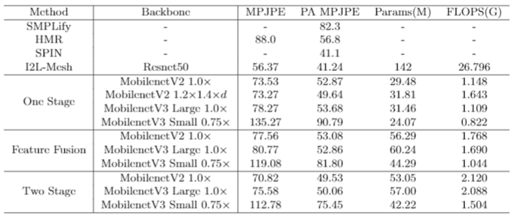

# 3D Mesh重建与动作生成
## Structure
```
codes
motion_generation
----LWGAN_baseline
--------iPERCore // 核心文件
------------data //定义数据集
------------models //定义模型
------------services //定义接口
------------tools //定义各种工具
--------assets //预训练模型，配置文件	
--------dist_train.py
--------motion_imitate.py
----feature_pixel_warp

motion_capture
//整体改动：添加计算效率速度等代码；添加定义数据集文件，human_single.py pw3d_single.py，可以在推理阶段使用，单独处理一个视频并可视化。另外human的root标签文件需要使用rootnet的代码生成，且需要将human中的get_subsampling_ratio改为1，即处理每一帧；在demo中添加可生成多人mesh的代码
----feature_fusion_mobilenetv2_100
//主要改动说明：./main/model.py整体 ，./common/base.py的优化器 。./common/nets中添加pose_net和mesh_net
----feature_fusion_mobilenetv3_large_100
//改动说明：同上，pose_net和mesh_net中使用的backbone不同
----feature_fusion_mobilenetv3_small_075
//改动说明：同上，pose_net和mesh_net中使用的backbone不同
----one_stage_mobilenetv2_100
//主要改动说明：./main/model.py整体 ，./common/base.py的优化器 。./common/nets中添加mesh_net
----one_stage_mobilenetv2_120d
//改动说明：同上，mesh_net中使用的backbone不同
----one_stage_mobilenetv3_large_100
//改动说明：同上，mesh_net中使用的backbone不同
----one_stage_mobilenetv3_small_075
//改动说明：同上，mesh_net中使用的backbone不同
----two_stage_mobilenetv2_100
//主要改动说明：./main/model.py整体 ，./common/base.py的优化器 。./common/nets中添加pose_net和mesh_net
----two_stage_mobilenetv3_large_100
//改动说明：同上，pose_net和mesh_net中使用的backbone不同
----two_stage_mobilenetv3_small_075
//改动说明：同上，pose_net和mesh_net中使用的backbone不同

```


## 运行
### Motion_capture
#### Train：
```
main/train.sh
```
#### Test:
```
main/test.sh
```
### Motion_generation
#### Train：
```
train.sh
```
#### Test:
```
test.sh
```
## Results
### Motion capture


<iframe src="//player.bilibili.com/player.html?aid=763380530&bvid=BV1kr4y117BA&cid=419263686&page=1" scrolling="no" border="0" frameborder="no" framespacing="0" allowfullscreen="true"> </iframe>

